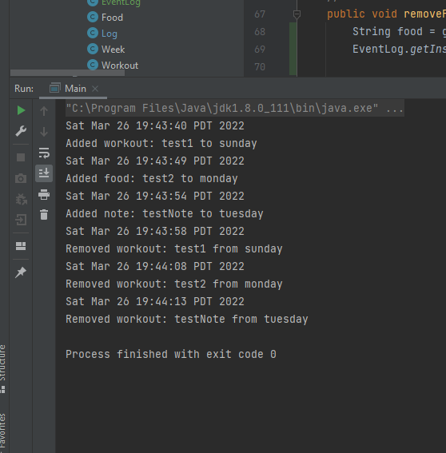
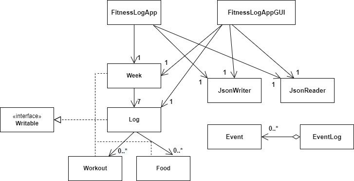

# My Personal Project

An example of text with **bold** and *italic* fonts.  

## What will the application do?
The application will allow user to log their workouts and diet.
In their logs they can keep track of what type of workout they did, for how long, and
how many calories they burned. In terms of nutrition they can keep track of their caloric intake, as well
as protein, fats, carbohydrates. All this over the course of a week.

## Who will use it?
Anyone looking to track their fitness progress and/or diet.

## Why is this project of interest to you?
I enjoy working out but keeping track of how healthy or unhealthy I've been
eating has always been difficult. Also, with these logs you can plan for 
workouts/meals ahead of schedule which is something that helps me keep things on the right
track and stay motivated.

## User Stories
- As a user, I want to be able to add a workout to my log
- As a user, I want to be able to add a meal to my log
- As a user, I want to be able to remove a meal or workout in case of a miss input. 
- As a user, I want to be able to see an overall summary of my calories in a day
- As a user, I want to be able to access specific logs in a week
- As a user, I want to be able to access everything about my workout(s) in a log
- As a user, I want to be able to access everything about my diet in a log
- As a user, I want to be able to notes to a log
- As a user, I want to be able to access my notes in a log
- As a user, I want to be able to save an instance of my logs
- As a user, I want to be able to load my previously saved instance logs
- As a user, I want to be reminded to save my logs when I quit the application

##Phase 4: Task 2

##Phase 4: Task 3

Reflection: If i have more time to work on the project, I would...

- Refactor the Log class, because there are repetitive for loops
- Add exception classes that are thrown for negative values to make "Week" and "Food" more robust classes
- Refactor some methods with adding and deleting objects to a log, because there is heavy repetition in the structure
